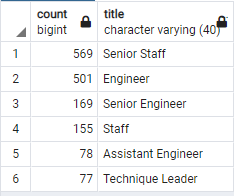
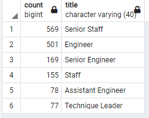
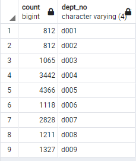

# Pewlett-Hackard Analysis
## Project Overview
While transferring Pewlett-Hackard to a SQL system, it was discovered that a large number of employees were approaching retirement age. To begin preparing for this mass exodus, it is important to know not only which employees would be retiring, but also what positions they would be vacating and how they would be replaced. Using SQL’s `JOIN` and `GROUP BY` functions, new tables were created to show the future retirees alongside their current positions, as well as a count of the number of retirees in each position. Next, in an attempt to plan for a smooth transition of responsibility during the large-scale retirement, a table was created to showcase employees who were eligible for mentorship.
## Results
-	There are 72,458 employees who are nearing retirement age.
-	As shown in the [retiring titles](Data/retiring_titles.csv) table, the majority of retirees occupy Senior Engineer and Senior Staff positions. 


-	There are 1,549 employees eligible to participate in a mentorship program.
-	Most of the possible mentors are either Senior Staff or Engineers. 


## Summary
-	**How many roles will need to be filled as the “silver tsunami” begins to make an impact?**
   - It is increadibly unlikely that all 72,000 retirement-ready employees will retire at once, but in order to approximate the beginning of the “silver tsunami” we can assume that the oldest employees will begin to retire first. Using the following query, we can find all of the oldest current employees who were born in 1952 and assume that they might be the first to retire.
```
SELECT DISTINCT ON (e.emp_no) e.emp_no, e.first_name, e.last_name, t.title, t.from_date, t.to_date, de.dept_no
INTO first_wave
FROM employees AS e
JOIN titles AS t
ON e.emp_no = t.emp_no
JOIN dept_emp AS de
ON e.emp_no = de.emp_no
WHERE (e.birth_date BETWEEN '1952-01-01' AND '1952-12-31') AND (t.to_date = '9999-01-01')
ORDER BY emp_no, to_date DESC;

SELECT COUNT(emp_no), dept_no
FROM first_wave
GROUP BY dept_no
ORDER BY dept_no;
```
Using the second part of the query, we can see the number of likely retirees per department during the first wave, and that a total of 16,981 employees are expected to retire, leaving their roles to be filled.


-	**Are there enough qualified, retirement-ready employees in the departments to mentor the next generation of Pewlett Hackard employees?**
   - Looking at the [mentorship eligibility table](Data/mentorship_eligibility.csv), if every eligible employee volunteered to act as a mentor, they would have to mentor approximately 10 employees each to train them to fill the vacant roles of the first wave. We can supplement the mentorship program by asking experienced employees who are ready for retirement to help mentor their successors.  Assuming that the retirees who have worked at Pewlett Hackard long enough to qualify for a retirement package are also qualified to act as mentors, we can conclude that there are potentially 33,118 more possible mentors who can train successors to fill the roles of the first wave. `SELECT COUNT(emp_no) FROM current_emp;` However, even combined with the qualified retirees, the mentorship program has half as many members as there are soon-to-be retirees, and it might struggle to mentor the next generation of employees if the rate of retirement is to large.
In order to expand the employee-pool from which we can find mentors, I suggest that any current employee who has worked at Pewlett Hackard for a significant time should be eligible for the mentor program. Using the following query, we can find all current employees who were hired between 1985 and 1988, and group them by their current department.
```
-- Mentorship qualification based on hire date
SELECT DISTINCT ON (e.emp_no) e.emp_no, 
	e.first_name, 
	e.last_name, 
	e.hire_date, 
	t.title, 
	t.to_date,
	de.dept_no
INTO qualified_mentors
FROM employees AS e
JOIN titles AS t
	ON e.emp_no = t.emp_no
JOIN dept_emp AS de
	ON e.emp_no = de.emp_no
WHERE (e.hire_date BETWEEN '1985-01-01' AND '1988-12-31') AND
	(t.to_date = '9999-01-01')
ORDER BY e.emp_no, t.to_date DESC;

-- Find total number of qualified mentors grouped by department
SELECT COUNT(emp_no), dept_no
FROM qualified_mentors
GROUP BY dept_no
ORDER BY dept_no;

SELECT COUNT(emp_no)
FROM qualified_mentors;
```
This will give Pewlett Hackard a total of 108,959 [possible mentors](Data/qualified_mentors.csv), which should hopefully be sufficient to train replacements for the 72,458 employees who are approaching retirement.

